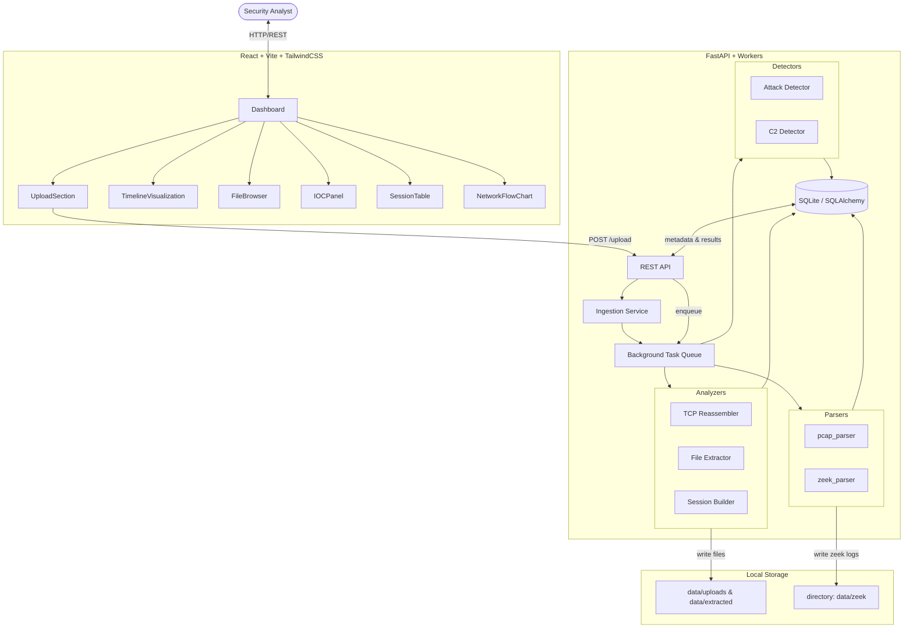

# NetRecon Forensics Workbench — Architecture

This document describes the high-level architecture, core components, dataflow, and deployment steps for the
NetRecon Forensics Workbench (the project in this repository). It is intended for developers and operators
who want to understand how PCAP ingestion, analysis, storage, and UI rendering fit together.



<!-- Link to the generated diagram (SVG) and the Mermaid source for easy editing -->


Mermaid source: `docs/architecture_diagram.mmd`

## Overview (short)
- Frontend: React + Vite provides the Dashboard UI that uploads PCAPs, polls analysis state, and renders results (timeline, extracted files, sessions, IOCs, charts).
- Backend: FastAPI exposes a small REST surface for uploads and data retrieval. A background worker pipeline performs heavy analysis (parsing, reassembly, file carving, detection).
- Storage: Raw PCAP uploads and carved blobs are stored on disk under `data/`. Analysis metadata (sessions, events, file records, IOCs) are persisted through SQLAlchemy to a SQLite database.

## Key Components

- Frontend
    - `frontend/src/pages/Dashboard.jsx` — Orchestrates polling, data fetches and tab rendering.
    - `UploadSection`, `TimelineVisualization`, `FileBrowser`, `IOCPanel`, `NetworkFlowChart`, `SessionTable` — UI widgets mapping directly to backend resources.

- Backend
    - `backend/main.py` — FastAPI app and startup/shutdown helpers (ensure directories, DB init).
    - `backend/api/routes.py` — REST endpoints: `/upload`, `/analysis/{id}`, `/timeline/{id}`, `/files/{id}`, `/iocs/{id}`, `/sessions/{id}`, report exports.
    - `backend/parsers/pcap_parser.py` and `backend/parsers/zeek_parser.py` — Lightweight wrappers to extract packets and integrate Zeek outputs.
    - `backend/analyzers/tcp_reassembler.py` — Reconstructs bidirectional TCP sessions, computes per-session stats and attempts protocol identification.
    - `backend/analyzers/file_extractor.py` — Carves HTTP and other protocol payloads, computes hashes and entropy, stores artifacts under `data/extracted/<file_id>/`.
    - `backend/detectors/*` — Heuristic detectors for port scans, C2 beaconing, exploitation patterns.
    - `backend/models/database.py` — ORM models for uploads, sessions, files, timeline events, IOCs and indicators.

## Data Flow (detailed)
1. Analyst uploads a PCAP via the Dashboard (`POST /upload?filename=...`).
2. Backend saves the binary to `data/uploads/<file_id>_...` and creates an `Upload` record in the DB with initial status `queued`.
3. The ingestion service enqueues a background task to analyze the file. Backend responds quickly with a `file_id` for polling.
4. Background worker steps (may run in-process or via a task queue):
     - Parse packets and produce lightweight records (timestamp, src/dst, proto, ports).
     - Reassemble TCP streams into sessions (bidirectional grouping by 5-tuple).
     - Attempt protocol identification for each session and run protocol-specific extractors (HTTP file carving, SMB object extraction, DNS parsing).
     - Invoke external tools if installed (Zeek for richer protocol logs, tshark for object export) when enabled in the environment.
     - Run detection heuristics on session metadata and logs to emit `TimelineEvent`s (port scans, exploit attempts, C2 beacons, lateral movement).
     - Persist artifacts: extracted files into `data/extracted/<file_id>/`, and metadata into the DB.
5. When analysis completes the worker updates the `Upload` record status to `completed` and sets progress to 100%.
6. Frontend polls `GET /analysis/{file_id}` and, upon completion, fetches `/timeline/{file_id}`, `/files/{file_id}`, `/iocs/{file_id}`, `/sessions/{file_id}` to render the results.

## Database & Storage
- Database: SQLite via `backend/models/database.py`. Models include:
    - Upload: file_id, filename, status, progress, created_at
    - Session: `src_ip`, `dst_ip`, `src_port`, `dst_port`, `protocol`, `packet_count`, `byte_count`, `session_duration`
    - ExtractedFile: filename, mime_type, path, md5, sha256, entropy, size
    - TimelineEvent: timestamp, event_type, severity, src_ip, dst_ip, description, evidence
    - IOC / Indicator: ioc_type, value, source

- Filesystem layout (relative to repo root):
    - `data/uploads/` — original uploaded captures
    - `data/extracted/<file_id>/` — carved files and artifacts
    - `data/zeek/` — optional Zeek output per upload
    - `data/db/` — SQLite database file

## REST API (summary)
- `POST /upload?filename=` — Upload capture bytes (returns `file_id`).
- `GET /analysis/{file_id}` — Status/progress for the analysis job.
- `GET /timeline/{file_id}` — Chronological events detected for the capture.
- `GET /files/{file_id}` — Metadata for extracted files.
- `GET /iocs/{file_id}` — Indicators of compromise.
- `GET /sessions/{file_id}` — Reconstructed network sessions.
- `GET /report/{file_id}/pdf` and `/json` — Exported analysis reports.

## Frontend Structure
- Built with Vite and React. The UI is intentionally thin — it fetches pre-aggregated JSON from the backend and focuses on visualization and interaction.
- Key UX patterns:
    - Upload triggers an asynchronous analysis workflow.
    - Polling updates a shared header progress bar and enables report downloads when ready.
    - Tabs isolate timeline, network view, files, sessions and IOCs for fast triage.

## Running Locally (developer quick-start)
Backend (from repo root):
```bash
cd backend
python -m venv .venv   # optional
.venv\\Scripts\\activate   # on Windows
pip install -r requirements.txt
uvicorn main:app --reload --host 0.0.0.0 --port 8000
```

Frontend (from repo root):
```bash
cd frontend
npm install
npm run dev    # development server (Vite)
# or build: npm run build && npm run preview
```

## Deployment notes
- This project is currently designed for local/small-scale use (SQLite + local storage). For production use consider:
    - Replacing SQLite with PostgreSQL and configuring connection in `backend/models/database.py`.
    - Moving extracted blobs to object storage (S3) and update stored paths accordingly.
    - Running background workers using a real queue (Redis + RQ/Celery) and scaling workers for parallel analysis.
    - Containerizing the frontend and backend (Docker) and orchestrating via docker-compose or Kubernetes.

## Security & Privacy
- Uploaded PCAPs may contain sensitive data (credentials, internal IPs). Ensure access controls and storage lifecycle policies.
- Consider running analysis in an isolated environment (container or VM) and scanning extracted files for malware before opening locally.

## Extensibility
- Parsers and analyzers are modular: add new detector modules under `backend/detectors/` and register them in the ingestion workflow.
- The frontend expects JSON endpoints; adding new analysis outputs only requires exposing a small REST route and a UI widget to consume it.

## Troubleshooting
- If analysis appears stuck: check backend logs, ensure `data/uploads` and `data/extracted` directories exist and are writable.
- For Zeek/tshark integrations, ensure those binaries are installed and accessible in PATH.

---
If you want, I can also generate a one-page diagram PDF from the mermaid block, or add an architectural SVG for the repo docs.
