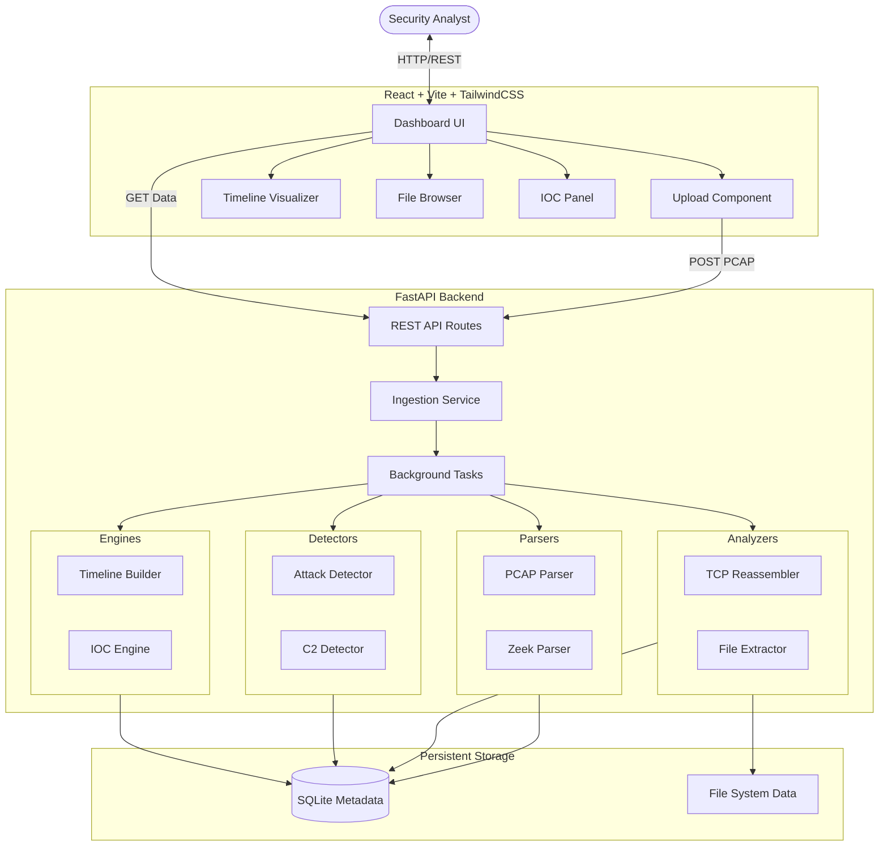

# NetRecon Forensics Workbench Architecture

## Data Flow
1. User uploads a PCAP via the React Dashboard.
2. The FastAPI backend saves the file to the local filesystem (`data/uploads`) and enqueues an asynchronous analysis task.
3. The pipeline begins processing the PCAP:
   - `tshark` is spawned to extract basic packet data and dump TCP streams into the SQLite database.
   - `Zeek` is spawned to generate contextual protocol logs (`conn.log`, `http.log`, `notice.log`).
   - `tshark --export-objects` is utilized to carve out HTTP, SMB, and TFTP objects, which are then hashed.
4. Detection modules execute SQL aggregations over the extracted TCP streams to detect Port Scans (many ports, one IP) and C2 Beaconing (repeated periodic connections to same destination).
5. The Timeline Builder aggregates alerts and file transfers into a chronological `TimelineEvent` sequence.
6. The frontend polls the API for completion. Once complete, it retrieves the aggregated JSON payloads to populate the Dashboard.
